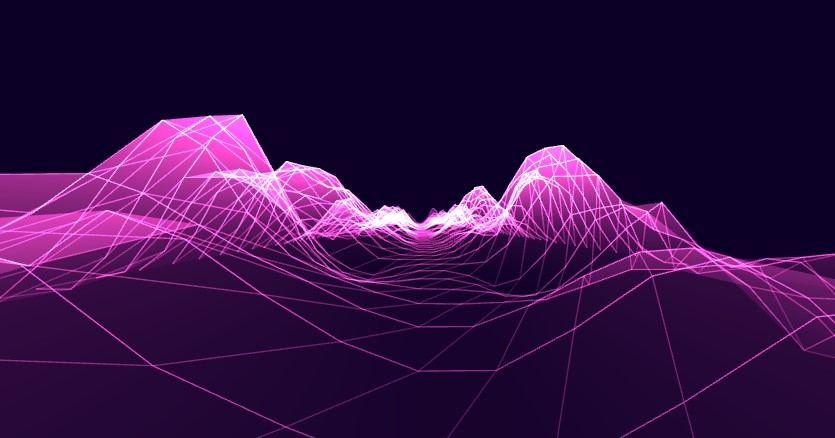

# Cyberspace Visualizer
A 3D visualizer that takes your mic audio and displays different the highs, mids and lows as octaves of perlin noise mountains. This is is WebGL port of another one of my projects:
[https://github.com/gabemcarvalho/opengl-audio-visualizer](https://github.com/gabemcarvalho/opengl-audio-visualizer)

To use the visualizer with music from your device, you will need to select a virtual audio cable as the microphone when prompted by your browser.

## Controls
The colour and speed controls from the original have not been implemented yet.

## Preview

